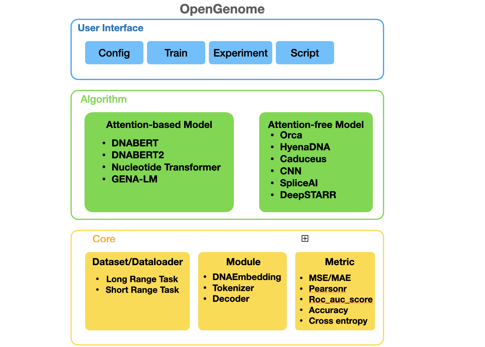
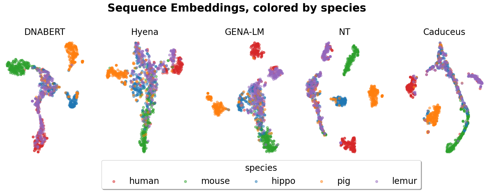
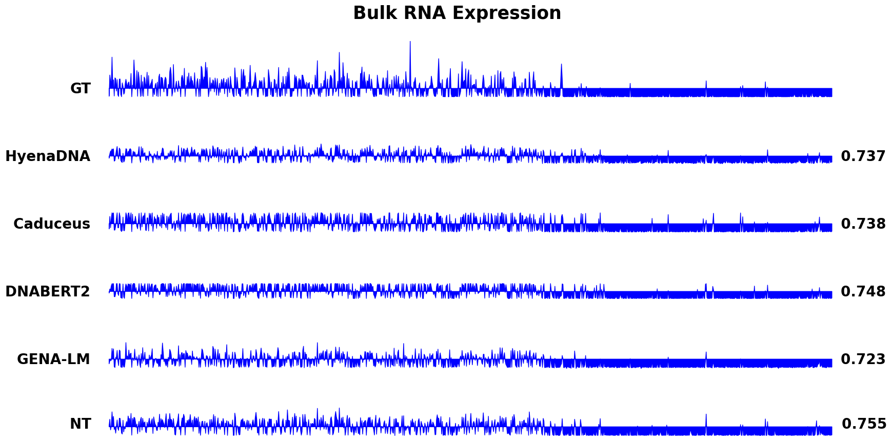
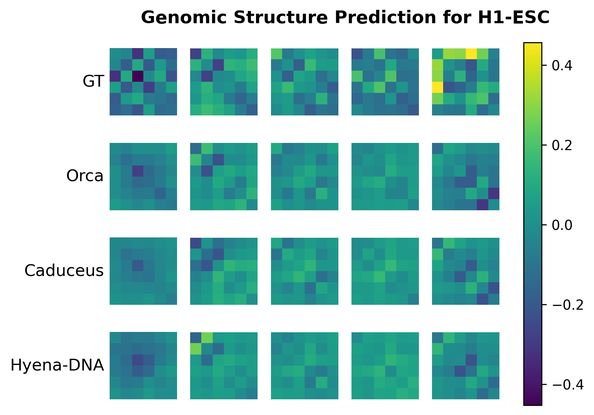
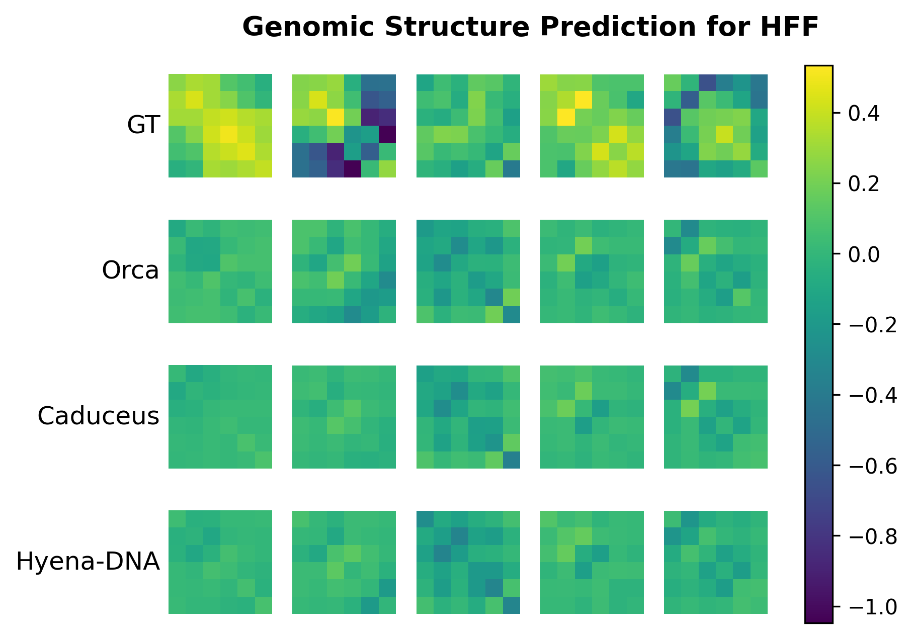
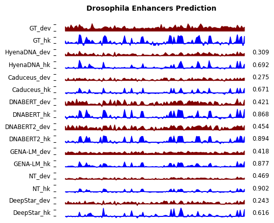

[NIPS 2024] GenBench: Комплексный бенчмарк геномных фундаментальных моделей
<p align="center" width="100%">
  
</p>


## Введение

GenBench — это комплексный бенчмарк для оценки геномных фундаментальных моделей, охватывающий широкий спектр методов и разнообразных задач: от предсказания расположения и функции генов до идентификации регуляторных элементов и изучения эволюции видов. GenBench предлагает модульную и расширяемую структуру, отличаясь удобством использования, организацией и всесторонностью. Кодовая база организована в три абстрактных слоя: базовый слой, алгоритмический слой и слой пользовательского интерфейса, расположенные снизу вверх.

<p align="center" width="100%">
  
</p>


<p align="right">(<a href="#top">Наверх</a>)</p>

## Обзор


</details>

<details open>
<summary>Структура кода</summary>

- `GenBench/configs/` - Конфигурационные файлы для бенчмарка и моделей:
  - `callbacks/` - Конфигурации обратных вызовов для тренировки
  - `dataset/` - Конфигурации для различных геномных датасетов
  - `experiment/` - Конфигурации для конкретных экспериментов
  - `model/` - Конфигурации моделей и слоев
  - `pipeline/` - Конфигурации обучающих пайплайнов
  - `scheduler/` - Конфигурации оптимизаторов и планировщиков скорости обучения
  - `task/` - Конфигурации для различных задач геномной биоинформатики
  - `trainer/` - Общие настройки тренировочных процессов

- `GenBench/data/` - Директория для данных и датасетов:
  - Включает промоторы, последовательности ChIP-seq и другие геномные данные
  - Файлы должны быть загружены или сгенерированы перед запуском экспериментов

- `GenBench/notebook/` - Jupyter-ноутбуки для анализа и визуализации:
  - Ноутбуки для визуализации результатов (структура генома, активность энхансеров)
  - Ноутбуки для анализа производительности и сравнения моделей
  - Ноутбуки для обработки данных и кластеризации

- `GenBench/src/` - Исходный код основного функционала:
  - `callbacks/` - Имплементации колбэков для тренировки
  - `dataloaders/` - Загрузчики данных для разных форматов геномных данных
  - `models/` - Имплементации моделей и архитектур (HyenaDNA, DNABERT, и др.)
  - `ops/` - Низкоуровневые операции для эффективных вычислений
  - `tasks/` - Реализации задач и метрик оценки
  - `utils/` - Вспомогательные функции и утилиты

- `GenBench/hyena_dna/` - Модуль HyenaDNA для работы с ДНК-последовательностями:
  - Реализация архитектуры HyenaDNA
  - Специализированные функции для ДНК-анализа

- `GenBench/weight/` - Веса предобученных моделей (доступны после загрузки)

- `GenBench/experiment/` - Скрипты для управления экспериментами:
  - Скрипты для различных задач (предсказание промоторов, сплайсинг и др.)
  - `.sh` файлы для запуска экспериментов с разными моделями

- `GenBench/docs/` - Документация по проекту

- `GenBench/examples/` - Примеры запуска и использования моделей

- `GenBench/scripts/` - Вспомогательные скрипты для подготовки данных

- Корневые файлы:
  - `download_models.py` - Скрипт для загрузки предобученных моделей
  - `interpret.py` и `interpret_hyenadna_captum.py` - Инструменты для интерпретации моделей
  - `setup.py` и `environment.yml` - Файлы для установки и настройки окружения
  - `train.py` - Основной скрипт для запуска тренировки моделей
  - `visualize_results.py` - Скрипт для визуализации результатов экспериментов

</details>


## Установка

В проекте предоставлен файл конфигурации окружения conda, пользователи могут легко воспроизвести окружение, используя следующие команды:
```shell

cd GenBench
conda env create -f environment.yml
conda activate OpenGenome
python setup.py develop
```

<!-- <details close>
<summary>Зависимости</summary>

* argparse
* dask
* decord
* fvcore
* hickle
* lpips
* matplotlib
* netcdf4
* numpy
* opencv-python
* packaging
* pandas
* python<=3.10.8
* scikit-image
* scikit-learn
* torch
* timm
* tqdm
* xarray==0.19.0
</details>

Более подробные инструкции см. в [install.md](docs/en/install.md). -->

## Начало работы

Вот пример однопроцессорного не-распределенного обучения HyenaDNA на датасете demo_human_or_worm:
```shell
bash tools/prepare_data/download_mmnist.sh
python train.py -m train experiment=hg38/genomic_benchmark_mamba \
        dataset.dataset_name=demo_human_or_worm \
        wandb.id=demo_human_or_worm_hyenadna \
        train.pretrained_model_path=path/to/pretrained_model \
        trainer.devices=1
```

## Интерпретация модели

GenBench теперь включает модуль интерпретации модели, использующий Captum для вычисления атрибуций нуклеотидов для предсказаний модели. Это помогает анализировать, какие части последовательности ДНК наиболее важны для решения модели.

### Использование модуля интерпретации

Вы можете запустить модуль интерпретации с помощью:
```shell
python interpret.py experiment=hg38/genomic_benchmark_hyena \
        dataset.dataset_name=demo_human_or_worm \
        train.pretrained_model_path=path/to/pretrained_model \
        interpret.attribution_method=ig \
        interpret.num_samples=10 \
        interpret.motif_id=MA0108.1
```

### Параметры интерпретации

- `interpret.attribution_method`: Метод вычисления атрибуций ('saliency', 'ig' для Integrated Gradients, 'dl' для DeepLift)
- `interpret.num_samples`: Количество образцов для анализа
- `interpret.motif_id`: ID мотива JASPAR для корреляции атрибуций (опционально)
- `interpret.target_class`: Целевой класс для атрибуции (по умолчанию: 0)
- `interpret.output_dir`: Директория для сохранения результатов интерпретации

### Визуализация

Модуль генерирует визуализации, показывающие:
- Значения атрибуции для каждой позиции нуклеотида
- Корреляция с известными мотивами из базы данных JASPAR (если указано)

## Повторение эксперимента
Для получения подробной информации об управлении экспериментами см. [experiment.MD](experiment/experiment.MD) и найдите скрипты в директории 'experiment'.


## Обзор модельного зоопарка и датасетов

Мы поддерживаем различные геномные фундаментальные модели. Мы работаем над добавлением новых методов и сбором результатов экспериментов.

* Методы пространственно-временного прогнозирования:

    <details open>
    <summary>Поддерживаемые методы</summary>

    - [x] [HyenaDNA](https://arxiv.org/abs/2306.15794) (NeurIPS'2023)
    - [x] [Caduceus](https://arxiv.org/abs/2403.03234) (Arxiv'2024)
    - [x] [DNABERT](https://academic.oup.com/bioinformatics/article/37/15/2112/6128680) (Bioinformatics'2021)
    - [x] [DNABERT-2](https://arxiv.org/pdf/2306.15006.pdf) (Arxiv'2023)
    - [x] [The Nucleotide Transformer](https://www.biorxiv.org/content/10.1101/2023.01.11.523679v3.abstract) (BioRxiv'2023)
    - [x] [Gena-LM](https://www.biorxiv.org/content/10.1101/2023.06.12.544594v1) (BioRxiv'2023)
   

    

* Бенчмарки геномных фундаментальных моделей:

    <details open>
    <summary>Поддерживаемые датасеты</summary>

    - [x] [Genomic benchmark](https://www.biorxiv.org/content/10.1101/2022.06.08.495248v1.full) (BMC Genomic Data'2023) [[скачать](https://huggingface.co/datasets/katielink/genomic-benchmarks/tree/main)] [[конфиг](experiment/genomic_benchmark)]
    - [x] [GUE](https://arxiv.org/pdf/2306.15006.pdf) (Arxiv'2023) [[скачать](https://drive.google.com/file/d/1GRtbzTe3UXYF1oW27ASNhYX3SZ16D7N2/view)] [[конфиг](experiment/GUE)]
    - [x] [Предсказание промоторов](https://basespace.illumina.com/projects/66029966/about) (BioRxiv'2023) [[скачать](https://github.com/AIRI-Institute/GENA_LM/tree/main/downstream_tasks/promoter_prediction)] [[конфиг](experiment/Promoter_prediction)]
    - [x] [Предсказание сайтов сплайсинга](https://dl.acm.org/doi/10.1177/0278364913491297) (Cell Press'2019) [[скачать](https://drive.google.com/file/d/1oB0DUrVfz-l0-wAe5_1kDVY5xZ1W4zMF/view?usp=share_link)] [[конфиг](experiment/Splicing_prediction)]
    - [x] [Предсказание активности энхансеров дрозофилы](https://www.nature.com/articles/s41588-022-01048-5) (Nature Genetics'2022) [[скачать](https://data.starklab.org/almeida/DeepSTARR/Data/)] [[конфиг](experiment/drosophila_enhancer_activity)]
    - [x] [Предсказание геномной структуры](https://www.nature.com/articles/s41588-022-01065-4) (Nature Genetics'2022) [[скачать](https://zenodo.org/record/6234936/files/resources_mcools.tar.gz)] [[конфиг](experiment/genomic_structure)]
    

    </details>

<p align="right">(<a href="#top">Наверх</a>)</p>

## Визуализация

Ниже мы представляем примеры визуализации HyenaDNA. Для получения более подробной информации обратитесь к соответствующим ноутбукам.

- Для задачи классификации видов визуализацию вложения t-sne можно найти в [notebook/gene_cluster.ipynb](notebook/gene_cluster.ipynb). 


<!-- | :---: | | -->
<div align=center></div>


- Для визуализации экспрессии Bulk RNA см. [notebook/Bulk_prediction_spearman.ipynb](notebook/Bulk_prediction_spearman.ipynb).


 <div align=center></div> 

- Для предсказания геномной структуры, визуализация предсказанных структур и структур из реальных данных показана в [notebook/plot_genomic_structure_h1esc.ipynb](notebook/plot_genomic_structure_h1esc.ipynb) и [notebook/plot_genomic_structure_hff.ipynb](notebook/plot_genomic_structure_hff.ipynb) после запуска эксперимента.

<div align=center>

</div>

<div align=center>

</div>


 


- Для предсказания активности энхансеров дрозофилы, визуализация предсказанных энхансеров и энхансеров из реальных данных показана в [notebook/drosophila_pearsonr.ipynb](notebook/drosophila_pearsonr.ipynb) после запуска эксперимента.

 <div align=center></div> 

- Для анализа пространственной сложности см. [notebook/count_flops.ipynb](notebook/count_flops.ipynb), а для анализа влияния длины и размера см. [notebook/performance_length.ipynb](notebook/performance_length.ipynb) и [notebook/parameter_size.ipynb](notebook/parameter_size.ipynb) соответственно.


<p align="right">(<a href="#top">Наверх</a>)</p>
